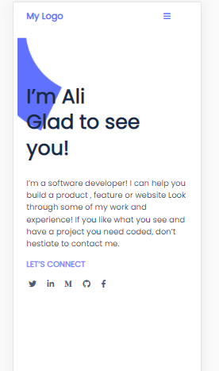

# Portfolio
Project: Sneak peek: your portfolio.
 
This Project is a clone of the figma template 1 (https://figma.com/)
A responsive design
 

 
 
## Built With
- HTML
- CSS
- Coffee
 
## Live Demo
[Live Demo Link] (https://aliabbani.github.io/Portfolio/)
 

## Authors

- Name: Ali Abbani
- GitHub: [@githubhandle](https://github.com/aliabbani)
- Twitter: [@twitterhandle](https://twitter.com/aliabbani)
- LinkedIn: [LinkedIn](https://www.linkedin.com/in/ali-abbani-8b6246150/)
 
            
## 🤝 Contributing
 
Contributions, issues, and feature requests are welcome!
 
Feel free to check the [issues page](issues/).
 
## Show your support
 
Give a ⭐️ if you like this project!
 
## Acknowledgments
 
- Hat tip to anyone whose code was used
- Inspiration
- etc
 
## 📝 License
 
This project is [MIT](lic.url) licensed.
=======
 